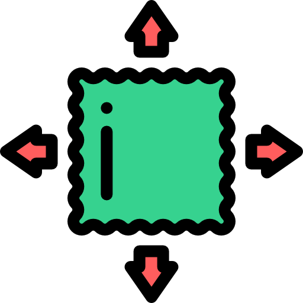

---
hide:
  - navigation
  - toc
---

<!-- Place this tag in your head or just before your close body tag. -->

## Research Mission

The main research approach that we have taken is to gain deep
understanding of the target systems and applications’ needs and to
rethink systems’ core abstractions based on the understanding; we
iterate between these two activities. We have
been motivated by real problems experienced by developers and
operators in practice. With these first-hand experiences, we perform
comprehensive measurements to pinpoint system bottlenecks,
characterize application behaviors and their needs, and understand
practitioners’ pain points.

A systems solution often requires designing a new abstraction or
adapting an existing abstraction in a novel way (e.g., in a new
scenario, under new settings or assumptions). We take different routes
when designing new systems solutions. On the one hand is *the freedom
of doing blue sky research*, where we openly question the fundamentals
underlying distributed systems in face of rapidly-emerging needs and
challenges. For example, we rethink the design of modern cloud storage
systems and build [the first, cost-effective cloud caching system that
exploits serverless functions as a novel storage medium](pdfs/fast20-infinicache.pdf){target="\_blank"}. 
On the other hand, *we seek practical and easily-deployable solutions
for otherwise sophisticated systems problems*. Distributed systems
often involve complex cross-component interactions in order to
support cross-cutting tasks such as scheduling. This leads us to
gravitate towards simple and general solutions that solve not a
specific problem, but which satisfy a general set of applications.
For instance, we design [a new function scheduler](pdfs/sc22-sfs-ae.pdf){target="\_blank"}, which
bridges the divide between user-space scheduling and kernel
scheduling while being transparent to any serverless platforms.

---

## Research Projects

We are committed to ***open science***. We make our research and its
dissemination, including publications, datasets, and software
artifacts, accessible to support use and development both in academia
and industry. 

The research artifacts are publicly available at 
[github.com/ds2-lab](https://github.com/ds2-lab){:target="\_blank"}.

  

	

	  
    

    

	  <h5>Serverless AI</h5>
		

Interactive ML/AI workloads require instant access to elastic GPU
resources. λScale accelerates serverless LLM deployments and
inference using RDMA and dynamic pipeline parallelism. NotebookOS
implements on-demand GPUs for Jupyter Notebook-based interactive
training workloads. 
        

		<ul>
  		  <li>λScale:  <a target="_blank" href="https://arxiv.org/abs/2502.09922">arXiv</a>&nbsp;&nbsp;
          </li>
  		  <li>NotebookOS:  <a target="_blank" href="https://arxiv.org/abs/2503.20591">arXiv</a>&nbsp;&nbsp;
          </li>
        </ul>
    

  

  

	

	  
    

    

	  <h5>Redesigning FaaS Platforms</h5>
		

Custom FaaS container support is gaining traction as it
enables better control over OSes, versioning, and tooling for
modernizing FaaS applications. Our research looks to build scalable
FaaS container platform that 1) offers fast container provisioning
and 2) minimizes cold starts under concurrent workloads.
        

		<ul>
  		  <li>FaaSNet:  <a target="_blank" href="/pdfs/atc21-faasnet.pdf">pdf</a>&nbsp;&nbsp;
			 <a target="_blank" href="https://github.com/ds2-lab/FaaSNet">code</a>&nbsp;&nbsp;
          </li>
  		  <li>CIDRE:  <a target="_blank" href="/pdfs/asplos25-cidre.pdf">pdf</a>&nbsp;&nbsp;
			 <a target="_blank" href="https://github.com/nzc5ve/cidre_asplos25">code</a>&nbsp;&nbsp;
          </li>
        </ul>
    

  

  

	

	  
    

    

	  <h5>Serverless Storage</h5>
		

We argue that the emerging serverless computing paradigm provides a
well-suited, cost-effective platform to fundamentally achieve elastic
data caching and data storage. 
Check out our serverless storage project series:
        

		<ul>
  		  <li>InfiniCache:  <a target="_blank" href="/pdfs/fast20-infinicache.pdf">pdf</a>&nbsp;&nbsp;
			 <a target="_blank" href="https://ds2-lab.github.io/infinicache/">project</a>&nbsp;&nbsp;
          </li>
  		  <li>InfiniStore:  <a target="_blank" href="/pdfs/vldb23-infinistore.pdf">pdf</a>&nbsp;&nbsp;
			 <a target="_blank" href="https://github.com/ds2-lab/infinistore">project</a>&nbsp;&nbsp;
          </li>
  		  <li>λFS:  <a target="_blank" href="https://arxiv.org/abs/2306.11877">pdf</a>&nbsp;&nbsp;
			 <a target="_blank" href="https://github.com/ds2-lab/LambdaFS">project</a>&nbsp;&nbsp;
          </li>
        </ul>
    

  

  

	

	  
    

    

	  <h5>Serverless Analytics</h5>
		

Running complex data analytics jobs on FaaS platforms is appealing
but also poses challenges for serverless execution frameworks, which
will need to rapidly scale and schedule tasks. Our research pioneers
to innovate serverless data analytics to make life easier for data
scientists.
        

		<ul>
  		  <li> <a target="_blank" href="/pdfs/socc20-wukong.pdf">pdf</a>&nbsp;&nbsp;
			 <a target="_blank" href="https://ds2-lab.github.io/Wukong/">project</a>&nbsp;&nbsp;
          </li>
        </ul>
    

  

  

	

	  
    

    

	  <h5>Serverless OS Scheduling</h5>
		

The execution time of serverless functions is typically short and
thus is sensitive to resource contention. The CPU schedulers of
today's main stream operating systems are simply not designed for
short-job-dominant FaaS workloads. Our research proposes new scheduling
techniques to address this mismatch.
        

		<ul>
  		  <li> <a target="_blank" href="https://arxiv.org/abs/2209.01709">pdf</a>&nbsp;&nbsp;
		   <a target="_blank" href="https://github.com/ds2-lab/SFS">project</a>&nbsp;&nbsp;
          </li>
        </ul>
    

  

  

	

	  
    

    

	  <h5>Federated Learning Systems</h5>
		

Federated Learning enables learning a shared model across many
clients without violating the privacy requirements. This learning approach
introduces interesting challenges across the whole system stack. Our research
aims to address these challenges to enable scalable, efficient, and robust
federated learning at scale.
        

		<ul>
  		  <li> <a target="_blank" href="/pdfs/hpdc20-tifl.pdf">pdf</a></li>
        </ul>
    

  

  

	

	  
    

    

	  <h5>Graph Learning Systems</h5>
		

It is challenging to train a graph neural network (GNN) on large
graphs, which are prevalent in today's applications such as social
networks and recommender systems.  Our research designs new
distributed GNN training methods that are scalable and efficient. 
        

		<ul>
  		  <li> <a target="_blank" href="https://arxiv.org/abs/2206.00057">pdf</a></li>
        </ul>
    

  

  
---
  
## Research Sponsors

We are grateful for the generous support from our sponsors, 
including
[National Science Foundation](https://www.nsf.gov){:target="\_blank"},
[Adobe Research](https://research.adobe.com/){:target="\_blank"},
[CloudBank](https://www.cloudbank.org/){:target="\_blank"},
[4-VA 4 Initiatives](https://4-va.org/){:target="\_blank"},
[Amazon Web Services](https://aws.amazon.com/){:target="\_blank"},
[Meta Research](https://research.facebook.com/){:target="\_blank"},
[Samsung](https://www.sait.samsung.co.kr/saithome/about/collabo_overview.do){:target="\_blank"},
[Google Cloud](https://cloud.google.com/){:target="\_blank"},
and [IBM Cloud](https://www.ibm.com/cloud){:target="\_blank"}.

 

  

	

      
     

  

    <h4>SPX: Collaborative Research: Cross-stack Memory Optimizations for Boosting I/O Performance of Deep Learning HPC Applications</h4>
      <ul>
      <li><b>Award Info: </b> National Science Foundation Award <a target="_blank" href="https://www.nsf.gov/awardsearch/showAward?AWD_ID=2318628&HistoricalAwards=false">CCF-2318628</a></li>
      <li><b>PI: </b> Yue Cheng</li>
      <li><b>Funding Amount: </b> $320,603</li>
      </ul>
  

  

	
  

  

    <h4>OAC Core: SMALL: DeepJIMU: Model-Parallelism Infrastructure for Large-scale Deep Learning by Gradient-Free Optimization</h4>
    <ul>
    <li><b>Award Info: </b> National Science Foundation Award <a target="_blank" href="https://www.nsf.gov/awardsearch/showAward?AWD_ID=2007976&HistoricalAwards=false">OAC-2007976</a></li>
    <li><b>PIs: </b> Liang Zhao (Emory), Yue Cheng</li>
    <li><b>Funding Amount: </b> $498,609</li>
    </ul>
  

  

	
  

  

    <h4>MRI: Acquisition of an Adaptive Computing Infrastructure to Support Compute- and Data-Intensive Multidisciplinary Research</h4>
    <ul>
    <li><b>Award Info: </b> National Science Foundation Award <a target="_blank" href="https://www.nsf.gov/awardsearch/showAward?AWD_ID=2018631&HistoricalAwards=false">MRI-2018631</a></li>
    <li><b>PIs: </b> Elise  Miller-Hooks (GMU), Shobita  Satyapal (GMU), Maria  Emelianenko (GMU), Yue Cheng, Jayshree  Sarma (GMU)</li>
    <li><b>Funding Amount: </b> $750,000</li>
    </ul>
  

  

	
  

  

  <h4>CAREER: Harnessing Serverless Functions to Build Highly Elastic Cloud Storage Infrastructure</h4>
    <ul>
    <li><b>Award Info: </b> National Science Foundation Award <a target="_blank" href="https://www.nsf.gov/awardsearch/showAward?AWD_ID=2322860&HistoricalAwards=false">CNS-2322860</a></li>
    <li><b>PI: </b> Yue Cheng</li>
    <li><b>Funding Amount: </b> $572,897 + $16,000 REU</li>
    </ul>
  

  

	
  

  

  <h4>FMSG: Cyber: Federated Deep Learning for Future Ubiquitous Distributed Additive Manufacturing</h4>
    <ul>
    <li><b>Award Info: </b> National Science Foundation Award <a target="_blank" href="https://www.nsf.gov/awardsearch/showAward?AWD_ID=2134689&HistoricalAwards=false">CMMI-2134689</a></li>
    <li><b>PIs: </b> Jia Liu (Auburn), Nima Shamsaei (Auburn), Yue Cheng</li>
    <li><b>Funding Amount: </b> $498,762</li>
    </ul>
  

  

	
  

  

    <h4>Collaborative Research: OAC Core: Distributed Graph Learning Cyberinfrastructure for Large-scale Spatiotemporal Prediction 🆕</h4>
    <ul>
    <li><b>Award Info: </b> National Science Foundation Award <a target="_blank" href="https://www.nsf.gov/awardsearch/showAward?AWD_ID=2403313&HistoricalAwards=false">OAC-2403313</a></li>
    <li><b>PI: </b> Yue Cheng</li>
    <li><b>Funding Amount: </b> $299,973</li>
    </ul>
  

  

	
  

  

    <h4>Elements: A Sustainable, Resource-Efficient Cyberinfrastructure for Notebook Interactive ML Training Workloads 🆕</h4>
    <ul>
    <li><b>Award Info: </b> National Science Foundation Award <a target="_blank" href="https://www.nsf.gov/awardsearch/showAward?AWD_ID=2411009&HistoricalAwards=false">OAC-2411009</a></li>
    <li><b>PIs: </b>Yue Cheng, Geoffrey Fox</li>
    <li><b>Funding Amount: </b> $600,000</li>
    </ul>
  

  

	
  

  

    <h4>REU Site: THE DATA JUSTICE ACADEMY 🆕</h4>
    <ul>
    <li><b>Award Info: </b> National Science Foundation Award <a target="_blank" href="https://www.nsf.gov/awardsearch/showAward?AWD_ID=2349503&HistoricalAwards=false">SMA-2349503</a></li>
    <li><b>PIs: </b>Claudia Scholz, Yue Cheng</li>
    <li><b>Funding Amount: </b> $481,232</li>
    </ul>
  

  

    
  

  

  <h4>Serverless Storage Management for Large-scale Analytics Workloads</h4>
    <ul>
    <li><b>Award Info: </b> Adobe Research Gift</li>
    <li><b>PI: </b> Yue Cheng</li>
    <li><b>Funding Amount: </b> $95,000</li>
    </ul>
  

  

    
  

  

  <h4>Serverless and Scalable GNN Training with Disaggregated Compute and Storage</h4>
    <ul>
    <li><b>Award Info: </b> <a target="_blank" href="https://research.facebook.com/research-awards/2022-request-for-research-proposals-for-ai-system-hardware-software-codesign/">Meta Research Award</a></li>
    <li><b>PIs: </b> Yue Cheng, Liang Zhao (Emory)</li>
    <li><b>Funding Amount: </b> $50,000</li>
    </ul>
  

  

    
  

  

  <h4>ML Workload Acceleration</h4>
    <ul>
    <li><b>Award Info: </b> 4-VA Collaborative Grant</li>
    <li><b>PIs: </b> Huaicheng Li (VT), Yue Cheng</li>
    <li><b>Funding Amount: </b> $5,000</li>
    </ul>
  

  

    
  

  

  <h4>Highly Efficient Pre-Trained LLM Storage with Near-Storage Compression and CXL Memory Integration 🆕</h4>
    <ul>
    <li><b>Award Info: </b> <a target="_blank" href="https://www.sait.samsung.co.kr/saithome/about/collabo_recipients.do">Samsung GRO 2023 Award</a></li>
    <li><b>PIs: </b> Yue Cheng, Ali Anwar (UMN)</li>
    <li><b>Funding Amount: </b> $250,000</li>
    </ul>
  

